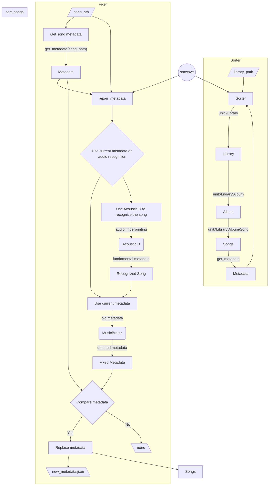

```mermaid
graph TD
    main@{ shape: circle, label: "sorwave" }
    main --> sorter[Sorter]
    main --> metadatafixer[repair_metadata]
    
    subgraph Sorter
        libraryPath@{ shape: lean-r, label: "library_path" }--> sorter
        sorter --> |unit:\Library| library[Library] -->|unit:\Library\Album| album[Album] --> |unit:\Library\Album\Song| song[Songs] --> |get_metadata| metadata[Metadata]
        metadata --> sorter
    end

    

    subgraph Fixer
        mbz(MusicBrainz)
        aid(AcousticID)
        songPath@{ shape: lean-r, label: "song_ath" } --> getMetadata[Get song metadata]-->|"get_metadata(song_path)"| metadataToFixer[Metadata]
        songPath --> metadatafixer
        metadataToFixer --> metadatafixer


        metadatafixer --> foption{Use current metadata or audio recognition}

        foption --> useMetadata[Use current metadata]
        foption --> useAID[Use AcousticID to recognize the song]

        useMetadata -.->|old metadata| mbz
        mbz -.->|updated metadata| fixedMetadata[Fixed Metadata]


        useAID -.-> |audio fingerprinting| aid
        aid -.-> |fundamental metadata| recognizedSong[Recognized Song]

        recognizedSong --> useMetadata[Use current metadata]
        compareMetadata{Compare metadata} 
            metadataToFixer --> compareMetadata{Compare metadata}

        fixedMetadata --> compareMetadata{Compare metadata} -->|Yes| replaceMetadata[Replace metadata] --> fixerOutYes@{ shape: lean-l, label: "new_metadata.json" }

        compareMetadata{Compare metadata} -->|No| fixerOutNo@{ shape: lean-l, label: "none" }

    end

    subgraph sort_songs
        
    end
    
    replaceMetadata--> song1[Songs]

```
